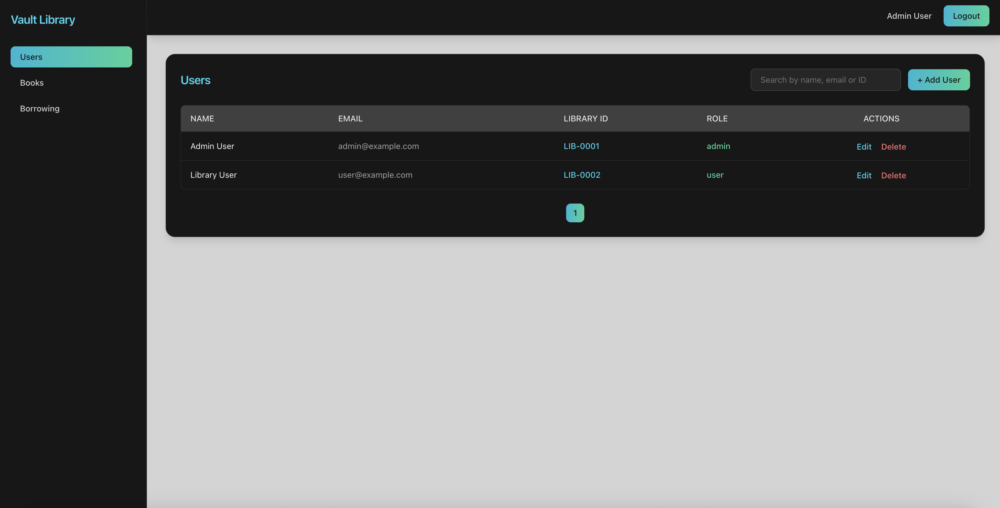
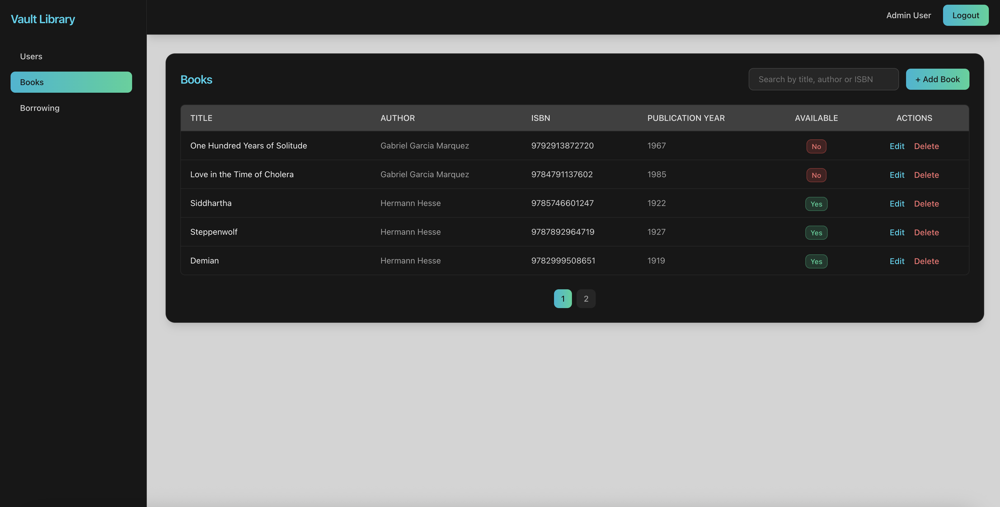
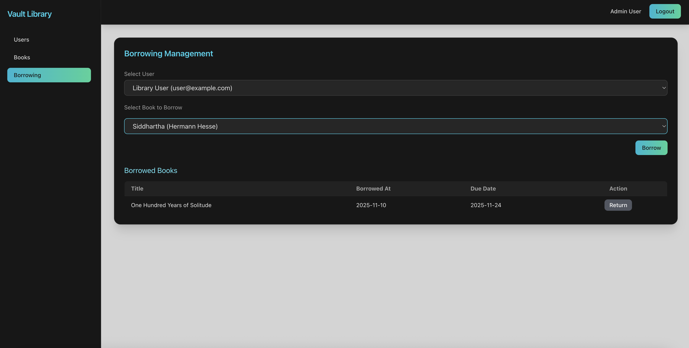
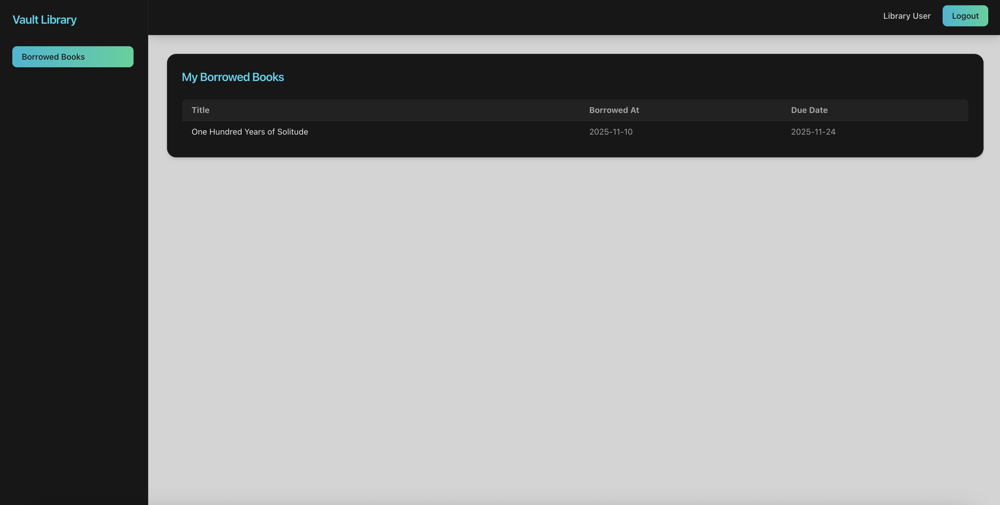

# Vault Library

Vault Library is a full-stack **Library Management System (LMS)** built with **Laravel** and **React**, designed with a **fintech-inspired workspace culture** that emphasizes execution, minimalism, and innovation.

The system allows admins and users to manage books, library members, and borrowing activities with data persisted in a relational database and a clean, responsive interface.

---

## Functionalities
The app allows users to:

- **Manage Books:**

    Admins can add, edit, delete, and retrieve books with attributes such as title, author, ISBN, publication year, and availability status.

- **Manage Library Users:**

    Admins can create, update, and remove library members, assigning roles as **admin** or **user**.

- **Borrow and Return Books:**

    Users can borrow up to **3 books at a time**. Borrowed books are automatically marked as unavailable and become available once returned. The system tracks borrowing history and due dates (default: 14 days).

- **Search Books:**

    Search books dynamically by title, author, or ISBN, with an intuitive and responsive interface.

**Authentication:**

Secure authentication and role-based access control using **Laravel Sanctum**.

**Admin AdminDashboard:**

Admins can manage all books and users, while regular users can view and track their borrowed books from a simple dashboard.

---

## Requirements

- **PHP** ^8.2
- **Composer** ^2.7
- **Laravel** ^11.x
- **MySQL** ^8.0
- **Node.js** ^22.12+
- **Npm** ^10.x
- **React** ^19
- **Vite** ^5.x
- **Tailwind CSS** ^3.x

---

## Installation

1. **Clone the repository**
   ```bash
   git clone https://github.com/judyz94/vault-library.git
   cd vault-library

2. **Install Laravel Dependencies**
   ```bash
   composer install

3. **Configure the .env file**

   Copy the sample file:
   ```bash
   cp .env.example .env
    ```
   
    Edit the .env file to configure your local environment:
    
    - Database credentials:
    > DB_CONNECTION, DB_HOST, DB_PORT, DB_DATABASE, DB_USERNAME, DB_PASSWORD
    
    - Application URL: 
    > APP_URL (e.g., http://127.0.0.1:8000)
    
    - Frontend API URL: 
    > VITE_API_BASE_URL (make sure it matches APP_URL + /api, e.g., http://127.0.0.1:8000/api)

4. **Generate the application key**
   ```bash
   php artisan key:generate

5. **Create DB in MySQL**

   The default name in the .env.example is "vault_library"


6. **Run migrations and seeders**
   ```bash
   php artisan migrate --seed

7. **Set the correct Node.js version**

   Before compiling the assets, make sure you are using the correct Node.js version
   ```bash
   nvm install 20
   nvm use 20

8. **Install Node.js Dependencies**
   ```bash
   npm install

9. **Compile the assets**
   ```bash
   npm run dev

10. **Start the local web server**
    ```bash
    php artisan serve

11. **Access the application**

    After the server is running, open your browser and go to the URL shown in the terminal (usually http://127.0.0.1:8000)


12. **Run the tests**

    To execute the test suite, you can use either of the following commands:

    Run tests using Laravel's built-in test runner:
    ```bash
    php artisan test
    ```

    Or, to generate a code coverage report in HTML:
    ```bash
    vendor/bin/phpunit --coverage-html coverage

13. **Generate API Documentation**

    This project uses Laravel Scribe to automatically generate API documentation from the routes and annotations. To generate or update the documentation, run:

    ```bash
    php artisan scribe:generate
    ```

    After generating, you can view the documentation locally by visiting:

    ```http
    http://127.0.0.1:8000/docs
    ```
    (or the corresponding URL for your local environment)

---

## Authentication & API Overview

This project provides a secure RESTful API for managing a digital library system, built with **Laravel Sanctum** for token-based authentication.

Users can log in to borrow and return books, while administrators can fully manage users, books, and borrowing records.

### Roles

- **Admin** — Has full system access.  
  Can:
    - Create, update, list, show and delete users.
    - Create, update, list, show and delete books.
    - Search books.
    - Borrow and return books on behalf of users.
    - View the list of borrowed books for any user.

- **User** — Has limited access.  
  Can:
    - Browse and search available books.
    - Borrow and return their own books.
    - View their own borrowing history.

### Authentication Flow

The authentication system uses **Laravel Sanctum** tokens.  
Users must first register or log in to obtain an **API token**, which must be included in subsequent requests via the `Authorization` header.

#### Headers Example
```http
Authorization: Bearer your_api_token_here
Accept: application/json
```

### Authentication API

**Base route:** `/api`

| Method | Endpoint         | Description                     | Auth Required |
|--------|------------------|----------------------------------|--------------|
| POST   | `/api/login`     | Log in and receive an API token  | No           |
| POST   | `/api/logout`    | Log out and revoke the token     | Yes          |

---

## Protected API Endpoints

All routes below require authentication (`auth:sanctum` middleware).

### Users API

**Base route:** `/api/users`

| Method | Endpoint             | Description              | Access (Role) |
|--------|----------------------|--------------------------|---------------|
| GET    | `/api/users`         | List all users           | Admin & User  |
| GET    | `/api/users/{id}`    | Get a specific user      | Admin & User  |
| POST   | `/api/users`         | Create a new user        | Admin only    |
| PUT    | `/api/users/{id}`    | Update an existing user  | Admin only    |
| DELETE | `/api/users/{id}`    | Delete a user            | Admin only    |

---

### Books API

**Base route:** `/api/books`

| Method | Endpoint            | Description             | Access (Role) |
|--------|---------------------|-------------------------|---------------|
| GET    | `/api/books`        | List all books          | Admin & User  |
| GET    | `/api/books/{id}`   | Get a specific book     | Admin & User  |
| SEARCH | `/api/books/search` | Search a book           | Admin & User  |
| POST   | `/api/books`        | Create a new book       | Admin only    |
| PUT    | `/api/books/{id}`   | Update an existing book | Admin only    |
| DELETE | `/api/books/{id}`   | Delete a book           | Admin only    |

---

### Borrowing API

**Base route:** `/api/users/{user}`

| Method | Endpoint                         | Description                                   | Access (Role)  |
|--------|----------------------------------|-----------------------------------------------|----------------|
| POST   | `/api/users/{user}/borrow`       | Borrow a book                                 | Admin & User   |
| POST   | `/api/users/{user}/return`       | Return a borrowed book                        | Admin & User   |
| GET    | `/api/users/{user}/borrowed`     | View user’s borrowed books and borrow history | Admin & User   |

---

## UI Flow

### Authentication
After the local server is running, open your browser and go to the URL shown in the terminal (usually http://127.0.0.1:8000)

Go directly to login route http://127.0.0.1:8000/login and log in using the following credentials for Admin role:

> ```php
> 'email' => 'admin@example.com'
> 'password' => '12345678%'
> ```

Or use these credentials for User library role:

> ```php
> 'email' => 'user@example.com'
> 'password' => '12345678%'
> ```

### Dashboard
After logging in, you’ll be taken to the Dashboard, which serves as the main page of the application.

The project includes two dashboards, one for **Admin** users and another for **Library Users**.

### Admin Dashboard

The admin dashboard features a left-side menu with three options: **Users**, **Books**, and **Borrowing**.

#### Users


- List all users in the system.
- Search users by **Name**, **Email**, or **Library ID**.
- View, edit, and delete users.
- Users table columns:
    - **Name**
    - **Email**
    - **Library ID**
    - **Role**

**User Form Fields and Instructions:**

| Field | Description | Example | Validation |
|-------|-------------|---------|-----------|
| name | The full name of the user. | Mariana Perez | required, string, max:255 |
| email | The unique email address of the user. | mariana.perez@example.com | required, email, unique |
| password | The user’s password. Must be at least 8 characters long and confirmed. | password123 | required, confirmed, min:8 |
| password_confirmation | Confirmation of the password. Must match the `password` field. | password123 | must match password |
| library_id | The unique library identifier assigned to the user. | LIB123456 | required, string, max:255, unique |
| role | The user’s role within the system. Must be one of the values defined in `UserRoleEnum`. | admin | nullable, enum |

 
#### Books


- List all books in the library.
- Search books by **Title**, **Author**, or **ISBN**.
- View, edit, and delete books.
- Books table columns:
    - **Title**
    - **Author**
    - **ISBN**
    - **Publication Year**
    - **Available**

**Book Form Fields and Instructions:**

| Field | Description | Example | Validation |
|-------|-------------|---------|-----------|
| title | Title of the book. | The Pragmatic Programmer | required, string, max:255 |
| author_id | ID of the author who wrote the book. | 1 | required, exists in authors table |
| isbn | Unique ISBN code of the book. | 978-0135957059 | required, string, unique |
| publication_year | Year the book was published. | 2019 | required, integer, min:1000, max:current year |
| available | Indicates if the book is available for loan. | true | boolean |


#### Borrowing

- Borrow books to different users in the system.
- Choose from the list of currently available books.
- Return books previously borrowed by users.
- View borrowed books per user.
- Borrowing table columns:
    - **Title**
    - **Borrowed At**
    - **Due Date**

### Library User Dashboard


The library user dashboard allows the logged-in user to:
- View the list of books currently borrowed by themselves.
- Borrowed books table columns:
    - **Title**
    - **Borrowed At**
    - **Due Date**  

---

## Progress Log

- **2025-11-07:** Project setup, Laravel backend and React frontend initialized.
- **2025-11-07:** Created models and migrations.
- **2025-11-07:** Created initial README file.
- **2025-11-08:** Created routes, middleware, controllers, services, requests and resources.
- **2025-11-08:** Implemented API endpoints, created and tested **POSTMAN** collection.
- **2025-11-09:** Built Login, Admin Dashboard layout and navigation menu.
- **2025-11-09:** Added search and filtering for Users and Books.
- **2025-11-09:** Implemented User and Book forms with validation.
- **2025-11-09:** Added Borrowing functionality (borrow/return books).
- **2025-11-09:** Implemented library User dashboard to view borrowed books.
- **2025-11-10:** Created factories and seeds.
- **2025-11-10:** Create feature tests.
- **2025-11-10:** Check and refactor code and fixed bugs.
- **2025-11-10:** Created documentation with **Laravel Scribe** and added necessary annotations.
- **2025-11-10:** Updated **README** file with UI flow instructions, progress log.

